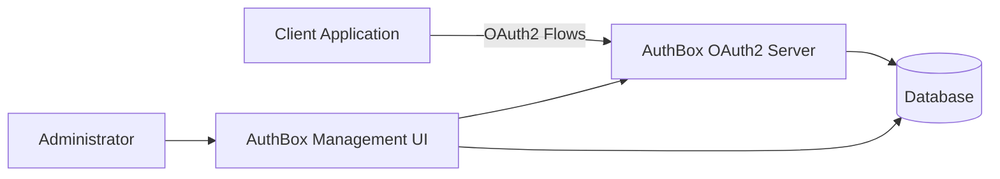
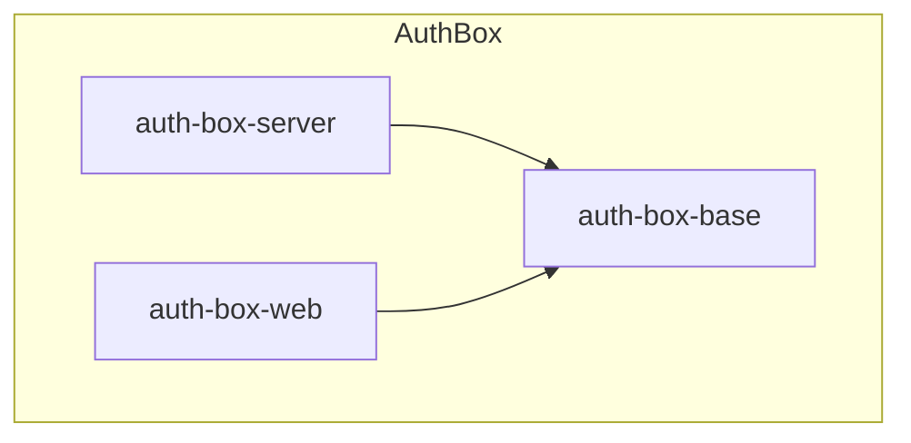

[](https://github.com/temesoft/auth-box/actions/workflows/main.yml)

# AuthBox

AuthBox is a free, open-source, RFC 6749–compliant OAuth2 Authorization Server implemented in Java using Spring Boot.  
It provides both a production-ready OAuth2 server and a management portal (UI + REST API) for configuring and operating the server.

AuthBox is designed for developers and organizations that require a self-hosted, extensible OAuth2 solution with full control over clients, users, scopes, and tokens.

---

## Table of Contents

- [Overview](#overview)
- [Demo](#demo)
- [Architecture](#architecture)
- [Repository Structure](#repository-structure)
- [Supported OAuth2 Flows](#supported-oauth2-flows)
- [Quick Start](#quick-start)
- [Configuration](#configuration)
- [Management Portal](#management-portal)
- [OAuth2 Usage Examples (curl)](#oauth2-usage-examples-curl)
- [Step-by-Step Use Cases](#step-by-step-use-cases)
- [Docker and Deployment](#docker-and-deployment)
- [Testing](#testing)
- [Security Notes](#security-notes)
- [Contributing](#contributing)
- [License](#license)

---

## Overview

AuthBox consists of two primary applications:

- **auth-box-server**  
  The OAuth2 authorization server responsible for issuing and validating tokens.

- **auth-box-web**  
  A management application that provides:
  - Web-based administrative UI
  - REST API for managing users, clients, scopes, and roles

Both applications share common code from **auth-box-base**.

---

## Demo
Full deployment of AuthBox (Oauth2 server and web management panel) is running on
<h3><a href='https://oauth2.cloud' target='newOauth2CloudWindow'>https://oauth2.cloud</a></h3>

* Software: OpenJDK 17, Spring-Boot, MySql

Please create an account to see complete functionality.
Registration process will create the following:

* Oauth2 management panel Admin account.
* Oauth2 client for service-to-service auth (`client_credentials`) which uses standard Oauth2 token.
* Oauth2 client for user auth (`password`, `authorization_code`, `refresh_token`) which uses JWT (RSA 2048 bit private key signed) token.
* One Oauth2 scope which is assigned to both clients.
* Oauth2 user (username: `test`; password: `test`) to demo user authentication or/and authorization.

---

## Architecture

### High-Level Architecture



### Component Architecture



---

## Repository Structure

```
auth-box/
├── auth-box-base        Shared libraries, models, security utilities
├── auth-box-server      OAuth2 authorization server
├── auth-box-web         Management UI and REST API
├── docker               Dockerfiles and compose examples
├── .github              CI/CD workflows
├── pom.xml              Maven parent project
└── README.md
```

---

## Supported OAuth2 Flows

AuthBox supports the following OAuth2 grant types:

- Authorization Code
- Password
- Client Credentials
- Refresh Token

Features include:

- JWT access tokens (RSA 2048)
- Refresh token rotation
- Configurable scopes
- Optional Two-Factor Authentication (2FA)
- Swagger/OpenAPI documentation

---

## Quick Start

### Prerequisites

- Java 11+
- Maven 3.8+
- Docker (recommended)
- MySQL or compatible database

### Clone and Build

```bash
git clone https://github.com/temesoft/auth-box.git
cd auth-box
mvn clean package
```

### Run Demo with Docker Compose

```bash
docker-compose -f docker/demo-docker-compose.yml up
```

Default endpoints:

| Service                     | URL                                         |
|-----------------------------|---------------------------------------------|
| Management UI               | http://localhost:8888                       |
| Management API (Swagger)    | http://localhost:8888/swagger-ui/index.html |
| OAuth2 Server API (Swagger) | http://localhost:9999/swagger-ui/index.html |

Default admin credentials:

```
username: admin
password: admin
```

---

## Configuration

AuthBox uses standard Spring Boot configuration.

Configuration sources:

- application.yml
- application.properties
- Environment variables

Example environment variables:

```bash
export SERVER_PORT=9999
export SPRING_DATASOURCE_URL=jdbc:mysql://localhost:3306/authbox
export SPRING_DATASOURCE_USERNAME=authbox
export SPRING_DATASOURCE_PASSWORD=secret
```

---

## Management Portal

The management portal (auth-box-web) allows administrators to:

- Manage users and roles
- Register OAuth2 clients
- Define scopes
- Enable or disable 2FA
- Inspect configuration and metadata

The portal exposes a full REST API in addition to the UI.

---

## OAuth2 Usage Examples (curl)

### Client Credentials Grant

```bash
curl -X POST http://localhost:9999/oauth/token \
  -u client-id:client-secret \
  -d grant_type=client_credentials \
  -d scope=read write
```

### Password Grant

```bash
curl -X POST http://localhost:9999/oauth/token \
  -u client-id:client-secret \
  -d grant_type=password \
  -d username=user@example.com \
  -d password=secret \
  -d scope=read
```

### Refresh Token

```bash
curl -X POST http://localhost:9999/oauth/token \
  -u client-id:client-secret \
  -d grant_type=refresh_token \
  -d refresh_token=REFRESH_TOKEN_VALUE
```

---

## Step-by-Step Use Cases

### Use Case 1: Register a Client and Obtain a Token

1. Log in to the Management UI.
2. Create a new OAuth2 client.
3. Assign allowed grant types and scopes.
4. Save the generated client ID and secret.
5. Request an access token using curl or your application.

### Use Case 2: Protect a Microservice

1. Configure your service to validate JWT tokens.
2. Use AuthBox as the token issuer.
3. Require `Authorization: Bearer <token>` header.
4. Validate scopes and claims.

### Use Case 3: Enable Two-Factor Authentication

1. Enable 2FA in the Management UI.
2. Assign 2FA to specific users or flows.
3. Authorization Code flow will require OTP verification.

---

## Docker and Deployment

### Build Docker Images

```bash
docker build -f docker/auth-box-server.dockerfile -t auth-box-server .
docker build -f docker/auth-box-web.dockerfile -t auth-box-web .
```

### Production Deployment

AuthBox can be deployed using:

- Docker Compose
- Kubernetes
- Cloud platforms (AWS, GCP, Azure)

Use an external database and enforce HTTPS in production.

---

## Testing

```bash
mvn test
```

---

## Security Notes

- Always run behind HTTPS
- Protect client secrets
- Rotate signing keys periodically
- Restrict admin access to management APIs

---

## Contributing

1. Fork the repository
2. Create a feature branch
3. Add tests for new functionality
4. Submit a pull request

---

## License

AuthBox is licensed under the GNU General Public License v3.0.

* the freedom to use the software for any purpose,
* the freedom to change the software to suit your needs,
* the freedom to share the software with your friends and neighbors
* the freedom to share the changes you make.
